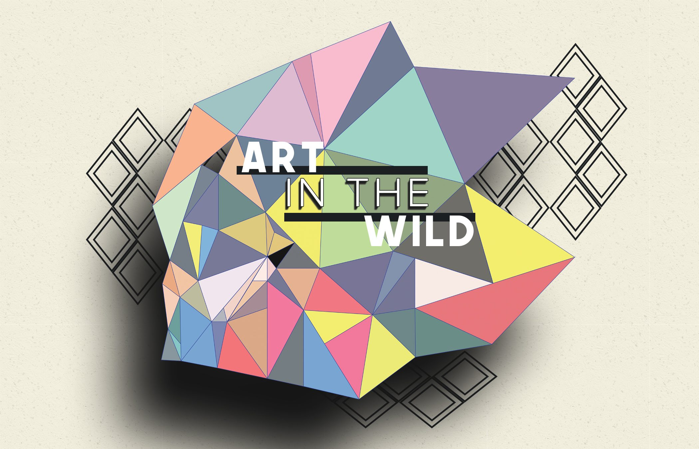

### Where Art Meets Adventure

### Built by: **[Matthew Gonczar](https://www.linkedin.com/in/matthew-gonczar/)**

**_Click the following link to be redirected to the live version of the code!_** 

## [Art in the Wild](https://art-in-the-wild.herokuapp.com/)

### Description:

Welcome to Art in the Wild, a full-stack application powered by the MERN stack (MongoDB, Express, React, Node.js). This innovative platform enables art enthusiasts to explore and connect with public art installations around the world, making it a delightful experience for both adventurers and creators alike.

### Features:

- Effortless Art Discovery: Seamlessly search for captivating public art pieces using the built-in search functionality. You can search by title, artist, or even zip code to find art closest to your location.

- Interactive Art Map: Experience the thrill of exploring art through an intuitive map generated by Mapbox. Art locations are marked with precision, guiding you on an unforgettable journey.

- User Registration and Authentication: Create your personal account to unlock exclusive features. Art in the Wild ensures your data's security with JWT-based session management.

- Contribute to the Art Community: Share your art discoveries with the world by uploading new art pieces you find. Capture moments of beauty by uploading pictures of art installations, leveraging Amazon S3 storage for efficient handling.

- Stylish Design with Bootstrap: The app is aesthetically crafted using Bootstrap, ensuring a visually appealing and user-friendly interface for a delightful experience.
  
- Art in the Wild is hosted on Heroku, allowing seamless access to the app from anywhere. The powerful combination of Vite and MERN ensures fast performance and responsiveness.

 <h2>:camera_flash: Visuals and Helpful Insight: </h2>

### Home Page

Immerse yourself in a captivating art journey on the home page, featuring an enticing image carousel showcasing stunning art uploads, along with six thoughtfully curated art cards, each offering unique descriptions of the showcased masterpieces.

### Search Page

Navigate the search page effortlessly using the intuitive search bar equipped with three filters: title, artist, and zipcode, empowering you to find your desired art pieces with precision. Engage with a dynamic map, adorned with location markers for each installation, making art exploration an immersive and rewarding experience.

### Found Artist Page

Explore a curated list of murals with insightful details on the searched art page, presented in an elegant card format.

### Upload Art Page

On the create page you can effortlessly upload found art to the platform. Seamlessly provide essential details, an artful photo, and location address, made convenient with the "Get Location" button or the address autocomplete by Mapbox. With automatic geocoding, your art's precise location will be elegantly showcased on the map, ensuring your discoveries become part of an inspiring global art collection.

### Profile Page

The Profile Page presents users with their own contributions to the platform. Additionally users can revist favorited art.

### Specefic Art Page

On the specific art page, you can view the most favorited photo first, followed by a collection of other art uploads. Unravel the art's narrative through its compelling details, including the title, creator, year installed, and a vivid description, allowing you to appreciate the artistry and significance behind each masterpiece.

 <h2>:camera_flash: How to Run Locally: </h2>

1. Clone this repository

1. Navigate to the project folder: cd art-in-the-wild

1. Install dependencies: npm install

1. Set up environment variables for MongoDB connection and Amazon S3 configuration.

1. Launch the local development server using Vite: npm run dev
